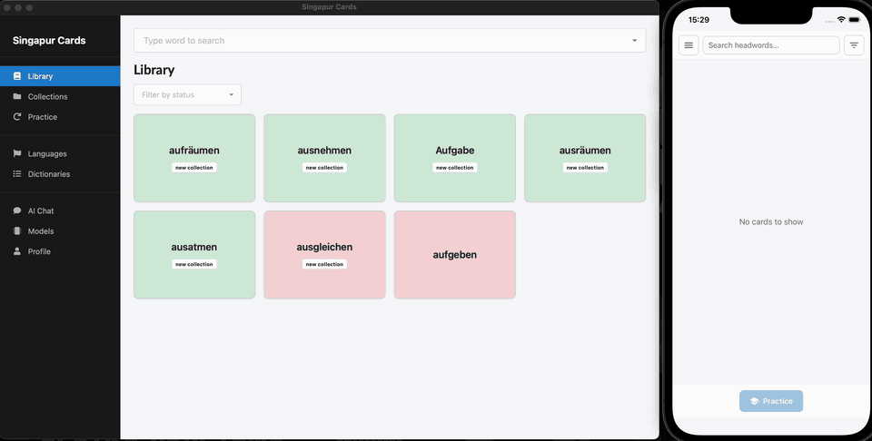

# 🃏 Singapur Cards

> Offline-first vocabulary learning app powered by ABBYY Lingvo DSL dictionaries.

Singapur Cards lets you turn any ABBYY Lingvo `.dsl` dictionary into a personal flashcard deck — no internet required. Import a dictionary, search headwords instantly, build your card collections, and drill vocabulary at your own pace with built-in review sessions.

## ✨ Features

- 📖 **Import DSL dictionaries** — load ABBYY Lingvo `.dsl` files from your local machine
- 🔍 **Fast headword search** — exact and prefix matching across large dictionaries
- 🃏 **Flashcard creation** — save any dictionary entry as a study card
- 🗂️ **Collections** — organize cards into named collections for focused study
- 🔁 **Review sessions** — mark cards as learned or not, with persisted progress
- 🤖 **AI Assistant** — built-in chat assistant to help you learn; connects to [OpenRouter](https://openrouter.ai) for access to a wide range of AI models
- ✈️ **Fully offline** — all data stays local in SQLite; no account or network needed (except for AI features)

## 🔄 Synchronization

- **Desktop + Mobile sync on LAN** — keep learning data aligned between your desktop and trusted mobile devices on the same network.
- **Secure pairing flow** — pairing uses a short-lived 6-digit code (60 seconds) plus desktop address (`host:port`).
- **Trusted device management** — desktop shows paired devices, last sync time, and lets you forget/revoke devices.
- **Local-first sync metadata** — changes, cursors, and tombstones are tracked in SQLite for resumable sync sessions.
- **No cloud relay in v1** — sync is peer-to-peer on local network only.
- **More details** — see [Sync feature docs](./docs/features/sync.md).

### Synchronization Preview

## 📦 Apps

| App | Description |
|-----|-------------|
| [🖥️ Desktop](./apps/desktop) | Native desktop client built with Tauri v2, React, and SQLite |
| [📱 Mobile](./apps/mobile) | Native mobile client |

## 🛠️ Tech Stack

- **Desktop app:** Tauri v2 (Rust) + React + TypeScript + Vite
- **Desktop UI:** Semantic UI React + styled-components
- **Desktop state:** Zustand
- **Desktop database:** SQLite (rusqlite + Tauri SQL plugin)
- **Desktop AI:** @assistant-ui/react + OpenRouter (configurable model backends)
- **Desktop testing:** Vitest + Rust unit/integration tests
- **Mobile app:** Expo + React Native + TypeScript + Expo Router
- **Mobile state:** Zustand
- **Mobile database:** SQLite (`expo-sqlite`) + Drizzle ORM
- **Mobile secure storage:** `expo-secure-store`

## 📚 Documentation

- [Developer Documentation](./docs/README.md)

## 🚀 Getting Started

See the [Desktop app README](./apps/desktop/README.md) for setup instructions.
See the [Mobile app README](./apps/mobile/README.md) for setup instructions.
