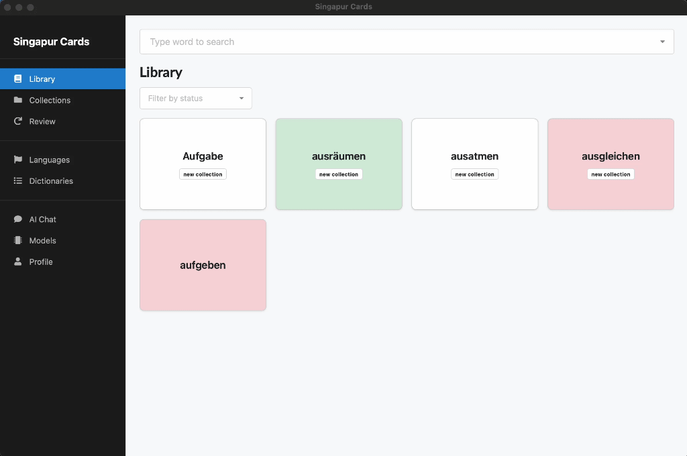

# Singapur Cards (Desktop) 📚

Offline-first desktop vocabulary learning app built with Tauri v2, React, and SQLite.

> Current platform support: **macOS and Windows desktop only**.

Singapur Cards helps you:
- import ABBYY Lingvo DSL dictionaries from local files
- search headwords quickly (exact + prefix)
- save dictionary entries as study cards
- organize cards into collections
- run local review sessions and persist progress

## Preview



> [!NOTE]
> The app is designed to work without network connectivity during normal use. Dictionary data, cards, collections, and review history are stored locally in SQLite.

## 🛠️ Tech Stack

- **Desktop shell:** Tauri v2 (Rust)
- **Frontend:** React + TypeScript + Vite
- **State management:** Zustand
- **UI:** Semantic UI React + Fomantic UI CSS + styled-components
- **Database:** SQLite (`rusqlite` + Tauri SQL plugin)
- **Testing:** Vitest + Rust unit/integration tests

## 🧭 Architecture at a Glance

- `src/` contains the React UI, routes, components (atomic design), and Zustand slices.
- `src-tauri/` contains Rust commands, SQLite schema/query layer, DSL parser/importer, and app state wiring.
- Tauri commands are exposed through typed wrappers in `src/lib/tauri/commands.ts`.
- SQLite is the source of truth; frontend state acts as a cache over command responses.

## ✅ Prerequisites

Before running the app, install:
- Node.js LTS
- Rust toolchain (`rustup`, `cargo`)
- Tauri v2 system prerequisites for your OS (macOS or Windows)

Reference: [Tauri Prerequisites](https://v2.tauri.app/start/prerequisites/)

## 🚀 Getting Started

From this directory (`apps/desktop`):

```bash
npm install
npm run tauri dev
```

This starts the Vite dev server and opens the desktop window via Tauri.

## 📜 Available Scripts

- `npm run dev` - start frontend dev server only
- `npm run tauri dev` - run desktop app in development mode
- `npm run build` - build frontend assets
- `npm run tauri build` - build desktop application bundle
- `npm run test` - run frontend test suite once
- `npm run test:watch` - run frontend tests in watch mode
- `npm run test:coverage` - run frontend tests with coverage
- `cargo test --manifest-path src-tauri/Cargo.toml` - run Rust tests
- `npm run seed:dev -- --seed 42 --db /path/to/db.sqlite` - seed deterministic dev data
- `npm run bench:search -- --entries 200000` - benchmark search performance

## 🔁 Core Product Flow

1. Import a local `.dsl` dictionary file with selected source/target languages.
2. Search imported headwords by language (exact or prefix matching).
3. Open headword detail and create/edit a study card.
4. Assign cards to collections for filtering and organization.
5. Start a review session and mark cards as learned or not learned.
6. Restart app and continue from persisted local state.

## 📥 DSL Import Notes

- Input format targets ABBYY Lingvo DSL dictionaries.
- Import is streaming and reports progress during parse/write operations.
- Malformed dictionary blocks are skipped and reported in warnings.
- Imported content is normalized and stored in SQLite; the original source file is not required afterward.

## 🧪 Testing and Verification

Run both frontend and backend tests:

```bash
npm run test
cargo test --manifest-path src-tauri/Cargo.toml
```

Additional verification:
- Use `npm run seed:dev` to generate realistic local data quickly.
- Use `npm run bench:search` to validate search performance gates on larger datasets.

## 🗂️ Project Layout

```text
apps/desktop/
├─ src/                     # React app (pages, components, store, theme)
│  ├─ components/
│  ├─ pages/
│  ├─ store/
│  └─ lib/tauri/commands.ts # typed invoke wrappers
├─ src-tauri/               # Rust backend (commands, db, dsl, app state)
│  ├─ src/commands/
│  ├─ src/db/
│  ├─ src/dsl/
│  └─ tests/
├─ docs/                    # format/spec docs (including DSL notes)
└─ specs/                   # feature specs, tasks, quickstart
```

## 🎯 Current Scope

The implemented MVP includes:
- dictionary import + search + headword detail
- card creation, editing, and deletion
- collection management and library filtering
- review sessions with persisted learning status
- development fixture seeding and search benchmarking
