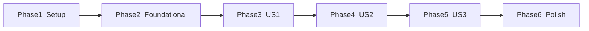

# Tasks: Custom AI model management for chat

**Input**: Design documents from [`spec.md`](./spec.md), [`plan.md`](./plan.md), [`research.md`](./research.md), [`data-model.md`](./data-model.md), [`contracts/`](./contracts/), [`quickstart.md`](./quickstart.md)

**Prerequisites**: `plan.md`, `spec.md` (user stories P1–P3); storage and UI contracts for implementation details.

**Tests**: Not mandated by `spec.md`; [`plan.md`](./plan.md) calls for extending RTL coverage—optional tasks appear in the Polish phase.

**Organization**: Phases follow user story priority; foundational work blocks all stories.

## Format: `[ID] [P?] [Story] Description`

- **[P]**: Can run in parallel (different files, no unmet dependencies)
- **[Story]**: User story label (`US1`–`US3`) on story-phase tasks only
- Every task includes at least one concrete file or document path

## Path conventions

- Paths below are relative to the **monorepo root** (`singapur-cards/`): `apps/desktop/src/...` (from `apps/desktop` only, read as `src/...`).
- This `tasks.md` is mirrored from the canonical feature folder at `specs/004-custom-ai-models/tasks.md` (monorepo root).

---

## Phase 1: Setup (shared context)

**Purpose**: Lock scope and confirm baseline before code changes.

- [x] T001 Run `npm test` in `apps/desktop` once to confirm a green baseline before feature work
- [x] T002 Read `specs/004-custom-ai-models/contracts/model-selector.contract.md` and `specs/004-custom-ai-models/contracts/custom-models-storage.schema.json` to align implementation with stable test IDs and persisted JSON shape

---

## Phase 2: Foundational (blocking prerequisites)

**Purpose**: Types, constants, DB layer, and Tauri commands required by all user stories. **No user story phase may start until this phase completes.**

- [x] T003 [P] Add `SavedModel` TypeScript type (`name`, `title`, `provider` all required strings, aligned with `custom-models-storage.schema.json`) in `apps/desktop/src/features/chat/customModelsTypes.ts`
- [x] T005a Add `custom_chat_models` table migration (`id TEXT PRIMARY KEY, name TEXT NOT NULL UNIQUE, title TEXT NOT NULL, provider TEXT NOT NULL, created_at TEXT NOT NULL`) to the `run_migrations()` batch in `apps/desktop/src-tauri/src/db/schema.rs`
- [x] T005b Add `list_custom_models`, `insert_custom_model`, and `delete_custom_model` query functions to `apps/desktop/src-tauri/src/db/queries.rs` following the existing `conn: &Connection` pattern
- [x] T005c Create `apps/desktop/src-tauri/src/commands/custom_models.rs` with Tauri commands `list_custom_models`, `add_custom_model` (normalize + duplicate check + insert), and `delete_custom_model`; register all three in `apps/desktop/src-tauri/src/lib.rs`
- [x] T005d Add typed `invoke` wrappers for the three commands in `apps/desktop/src/lib/tauri/commands.ts`; add normalize, merge + FR-012 ordering helpers in `apps/desktop/src/features/chat/customModelsStorage.ts`

**Checkpoint**: Three Tauri commands are callable from the frontend; helpers and fallback constant are available for UI wiring.

---

## Phase 3: User Story 1 — Choose a model for chat (Priority: P1) — MVP

**Goal**: User sees built-ins plus saved customs in one ordered list and can change the active model (FR-001, FR-007, FR-012).

**Independent test**: Open chat; dropdown lists catalog-first then custom-by-title; changing selection updates active model without add/remove flows.

- [x] T006 [US1] On mount, call `invoke('list_custom_models')` and set result into React state (empty array on error); pass into composer in `apps/desktop/src/pages/ChatPage.tsx`
- [x] T007 [US1] Build ordered model options from saved entries via `customModelsStorage`, wire `onModelChange` and `data-testid="model-selector"` in `apps/desktop/src/components/molecules/ChatComposer.tsx`; confirm dropdown visually reflects the current active selection value (SC-005)

**Checkpoint**: Selection works with zero customs (built-ins only) and with pre-existing saved rows once Phase 2 data exists in storage.

---

## Phase 4: User Story 2 — Add a custom model (Priority: P2)

**Goal**: Add flow with modal for identifier + title, validation FR-004/FR-005, persistence FR-006, immediate list refresh FR-009.

**Independent test**: Add one model, restart app, entry still listed and selectable (maps to SC-001/SC-002).

- [x] T008 [US2] Add Semantic UI `allowAdditions` / `onAddItem`, add-model `Modal` with three labeled fields — `name` (identifier), `title` (display label), `provider` (required) — each with an associated `<label>` or `aria-label`; non-empty validation on all three, duplicate rejection messaging, and contract `data-testid`s (`custom-model-modal`, `custom-model-save`, etc.) in `apps/desktop/src/components/molecules/ChatComposer.tsx`
- [x] T009 [US2] Wire save handler to `invoke('add_custom_model')` + state refresh; catch errors and show non-blocking message per FR-011/spec edge cases; enforce reasonable max length on inputs per `specs/004-custom-ai-models/data-model.md` before invoking; confirm `react-hot-toast` is already in `package.json` before using it, otherwise use state-based feedback in `apps/desktop/src/pages/ChatPage.tsx` (or composer props)

**Checkpoint**: New customs persist across reload and appear in correct sort order.

---

## Phase 5: User Story 3 — Remove saved custom models (Priority: P3)

**Goal**: Manage modal lists only user-saved rows with delete; FR-008/FR-009/FR-010 including fallback when active removed.

**Independent test**: Remove non-active and active custom; after active removal, selection matches FR-010 (default or first in FR-012 order).

- [x] T010 [US3] Add “Manage models” entry point opening `manage-custom-models-modal` with per-row delete and `custom-model-delete` test hooks; delete buttons must be keyboard reachable (tab-focusable) in `apps/desktop/src/components/molecules/ChatComposer.tsx`
- [x] T011 [US3] On delete: call `invoke('delete_custom_model', { name })`, refresh list, and if deleted name equals `selectedModel`, set `selectedModel` to the first model in FR-012 order, or `null` if none remain; surface explicit blocked state when no models remain per Edge Cases in `apps/desktop/src/pages/ChatPage.tsx`

**Checkpoint**: Removal persists; active-model fallback never leaves chat broken when any model remains.

---

## Phase 6: Polish and cross-cutting

**Purpose**: Tests, manual QA, and residual edge cases from `spec.md`.

- [x] T012 [P] Extend `apps/desktop/src/test/ChatPage.test.tsx` with Tauri `invoke` mocks (vi.mock `@tauri-apps/api/core`) and coverage for model selector ordering, add-save, manage-delete, and fallback behavior per `specs/004-custom-ai-models/contracts/model-selector.contract.md`
- [x] T013 [P] Verify (not re-implement) that `invoke` error paths from T005c/T005d show non-crashing error or safe empty state without disturbing unrelated state in `apps/desktop/src/pages/ChatPage.tsx`
- [x] T014 Walk through `specs/004-custom-ai-models/quickstart.md` (SC-001–SC-005 and constitution spot-checks) and fix gaps found in `apps/desktop/src/components/molecules/ChatComposer.tsx` or `apps/desktop/src/pages/ChatPage.tsx`

---

## Dependencies and execution order

### Phase dependencies



- **Phase 1** → **Phase 2** → **Phase 3 (US1)** → **Phase 4 (US2)** → **Phase 5 (US3)** → **Phase 6**
- User stories are **sequential** for this feature: US2 builds on merged list + state from US1; US3 builds on add/remove persistence from US2.

### User story dependencies

| Story | Depends on | Notes |
|-------|----------------|-------|
| US1 | Foundational | Selection only; works with built-ins if storage empty |
| US2 | US1 | Dropdown additions + modal need stable selection wiring |
| US3 | US2 | Delete targets persisted customs |

### Parallel opportunities

- **Phase 2**: T003 can run in parallel with T005a before T005b–T005d.
- **Phase 6**: T012 and T013 can run in parallel; T014 after or alongside once behavior stable.

### Parallel example: Foundational

```bash
# After Phase 1:
# Task T003: apps/desktop/src/features/chat/customModelsTypes.ts
# Then Task T005: apps/desktop/src-tauri/... + customModelsStorage.ts
```

---

## Implementation strategy

### MVP first (User Story 1 only)

1. Complete Phase 1 and Phase 2.
2. Complete Phase 3 (US1); verify dropdown ordering and selection against built-ins + any pre-seeded `localStorage` data.
3. Stop and demo before add/remove if desired.

### Incremental delivery

1. Foundation → US1 (usable catalog + selection).
2. US2 → persisted customs.
3. US3 → full lifecycle + fallback.
4. Polish → RTL + quickstart hardening.

### Suggested MVP scope

- **Phases 1–3** (through US1) deliver minimal shippable value: correct combined list and selection per FR-012.

---

## Task summary

| Phase | Task IDs | Count |
|-------|-----------|-------|
| Setup | T001–T002 | 2 |
| Foundational | T003, T005a–T005d | 5 |
| US1 | T006–T007 | 2 |
| US2 | T008–T009 | 2 |
| US3 | T010–T011 | 2 |
| Polish | T012–T014 | 3 |
| **Total** | | **16** |

---

## Format validation

- All tasks use the checklist line: `- [ ] Tnnn ...`
- **[P]** only on T003, T004, T012, T013; T005a–T005d are sequential (each depends on prior)
- **[US1]**–**[US3]** only on T006–T011
- Each task names at least one path under `apps/desktop/` or `specs/004-custom-ai-models/`

---

## Notes

- No questions for the product owner were required: `spec.md` clarifications and `research.md` resolve default model and ordering; “grill” items are deferred to code-level handling (e.g., max string lengths) per `data-model.md`.
- Suggested next command: **`/speckit.implement`** (or begin implementation using this `tasks.md` order).
