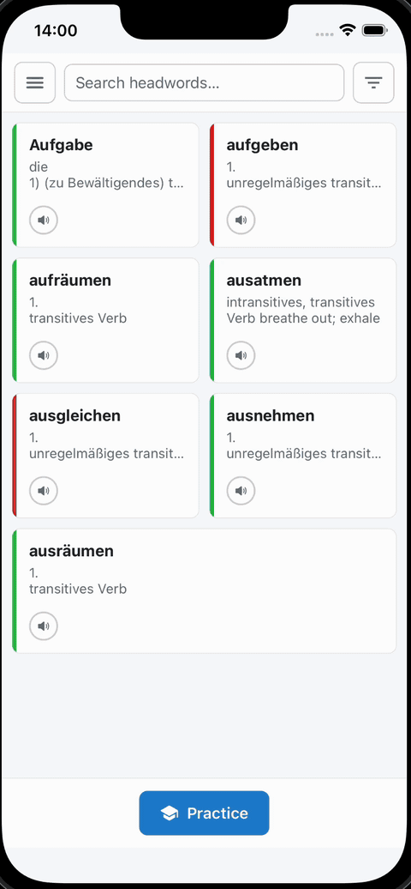

# Singapur Cards (Mobile) 📱

Offline-first mobile companion app for Singapur Cards, built with Expo, React Native, and SQLite.

Singapur Cards Mobile helps you:
- browse and filter study cards locally
- organize cards into collections
- run review sessions on device
- pair with the desktop app over local network
- sync cards and collections with desktop

## Preview



> [!NOTE]
> The app is designed to work offline during normal use. Local data is stored in on-device SQLite and can sync with desktop when both devices are available on the same LAN.

## 🛠️ Tech Stack

- **Mobile framework:** Expo + React Native
- **Routing:** Expo Router
- **State management:** Zustand
- **Database:** Expo SQLite + Drizzle ORM
- **Secure secrets:** Expo Secure Store
- **Tooling/scripts:** TypeScript + `tsx` + Drizzle Kit

## 🧭 Architecture at a Glance

- `src/app/` contains route screens (cards, collections, review, settings, sync).
- `src/components/` follows atomic design (`atoms`, `molecules`, `organisms`).
- `src/store/` contains Zustand slices for cards, collections, filters, and sync state.
- `src/db/` contains schema, migrations, and SQLite bootstrap setup.
- `src/lib/` contains sync client + device identity helpers for desktop pairing.

## ✅ Prerequisites

Before running the app, install:
- Node.js LTS
- iOS Simulator (Xcode) and/or Android Emulator
- Expo/React Native local build prerequisites for your OS

Reference: [Expo - Environment setup](https://docs.expo.dev/get-started/set-up-your-environment/)

## 🚀 Getting Started

From this directory (`apps/mobile`):

```bash
npm install
npm run start
```

Then open in:
- iOS simulator: press `i` in Metro, or run `npm run ios`
- Android emulator: press `a` in Metro, or run `npm run android`
- Web preview: run `npm run web`

## 📜 Available Scripts

- `npm run start` - start Expo dev server
- `npm run ios` - start Expo and launch iOS target with shared dev DB path
- `npm run android` - start Expo and launch Android target with shared dev DB path
- `npm run ios:run` - build and run native iOS app via `expo run:ios`
- `npm run pod:install` - install iOS CocoaPods dependencies
- `npm run web` - run Expo web target
- `npm run test` - run the mobile test suite
- `npm run db:seed` - seed a local development SQLite database
- `npm run db:clean` - remove user-generated data from local SQLite DB
- `npm run db:generate` - generate Drizzle migration artifacts

## 🔁 Core Product Flow

1. Launch app and browse cards stored locally.
2. Filter by collection and learning language.
3. Open card details and review card content.
4. Start a practice session and update learning status.
5. Pair mobile with desktop in **Settings → Desktop Sync**.
6. Run manual sync to exchange changes with desktop.

## 🔄 Desktop Sync Notes

- Sync uses local-network HTTP between mobile and desktop app.
- Pairing requires:
  - desktop host/port
  - 6-digit pairing token shown in desktop app
- Credentials are stored in secure device storage.
- If pairing is revoked on desktop, mobile will require re-pairing.
- Local app remains usable offline even when sync is unavailable.

## 🗃️ Local Database Notes

- Main on-device DB file: `singapur_cards_mobile.db`.
- In development, `EXPO_PUBLIC_DEV_SQLITE_DIR` can pin DB location to repo `.data/`.
- `npm run db:seed` / `npm run db:clean` target `.data/singapur_cards_mobile.db` by default.
- You can override DB path with `--db /path/to/file.db`.

Examples:

```bash
npm run db:seed -- --seed 42
npm run db:seed -- --db ./.data/custom.db
npm run db:clean -- --db ./.data/singapur_cards_mobile.db
```

Before opening a PR, run:

```bash
npm run test
```

## 🗂️ Project Layout

```text
apps/mobile/
├─ src/
│  ├─ app/                # Expo Router screens/routes
│  ├─ components/         # UI by atomic design layers
│  ├─ hooks/              # Data + view hooks
│  ├─ store/              # Zustand state slices
│  ├─ db/                 # Drizzle schema + migrations + SQLite init
│  └─ lib/                # Sync client and device identity helpers
├─ scripts/               # Dev DB tooling (seed/clean)
├─ ios/                   # Native iOS project (prebuild/run:ios)
└─ app.json               # Expo app config
```

## 🎯 Current Scope

The current mobile scope includes:
- offline card browsing, filtering, and detail view
- collections support and review flow
- local language selection for study context
- desktop pairing + pull/push sync
- dev database seeding and cleanup utilities
