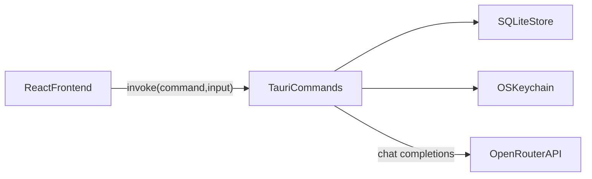

# System Architecture

## Runtime Topology



## Responsibility Split

- Frontend (`apps/desktop/src`)
  - Routing, UI composition, and client-side interaction state.
  - Typed command wrappers for Tauri invocation.
  - Render loading, success, and recoverable error states.
- Local backend (`apps/desktop/src-tauri/src`)
  - File import/parsing orchestration, domain commands, and validation.
  - SQLite reads/writes and command response envelopes.
  - Credential lookup from keychain by provider and credential identity.
- External provider
  - OpenRouter handles remote AI inference only.

## Integration Contracts

```ts
type CommandSuccess<T> = { ok: true; data: T }
type CommandFailure = { ok: false; code: string; message: string }
```

- All command calls use explicit success/failure payloads.
- Structured conflict responses are used for deterministic UI recovery where needed.

## Storage Boundaries

- SQLite:
  - Dictionaries, entries, cards, collections, reviews, language rows.
  - AI credential metadata only (no plaintext key).
- OS keychain:
  - Raw API key strings.
- No central backend database.

## Security Model

- Credential raw values never return to frontend in command payloads.
- Command errors must be user-safe and avoid exposing secrets.
- Local-first architecture minimizes network dependency for non-AI features.
